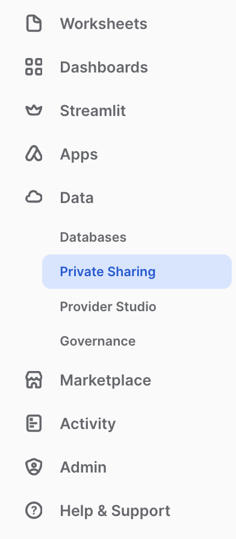
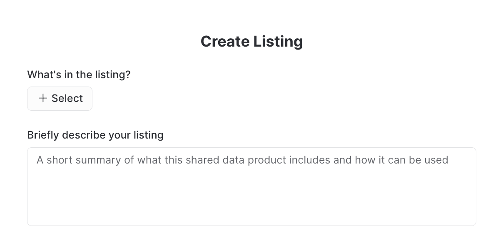
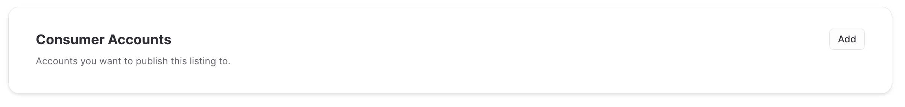
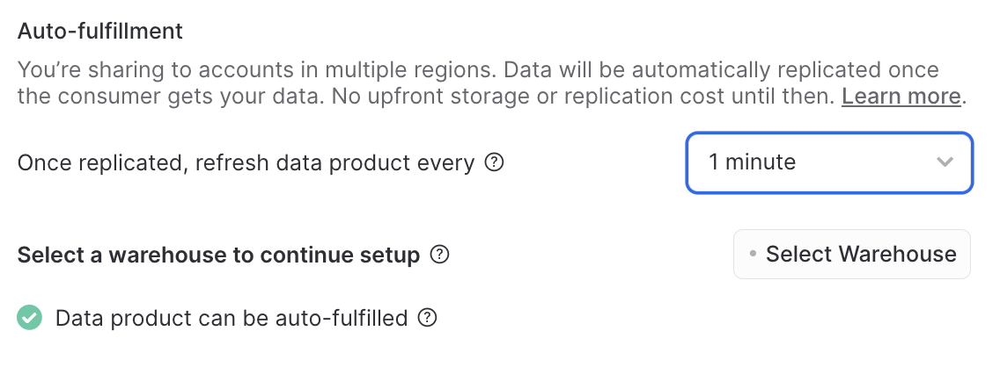
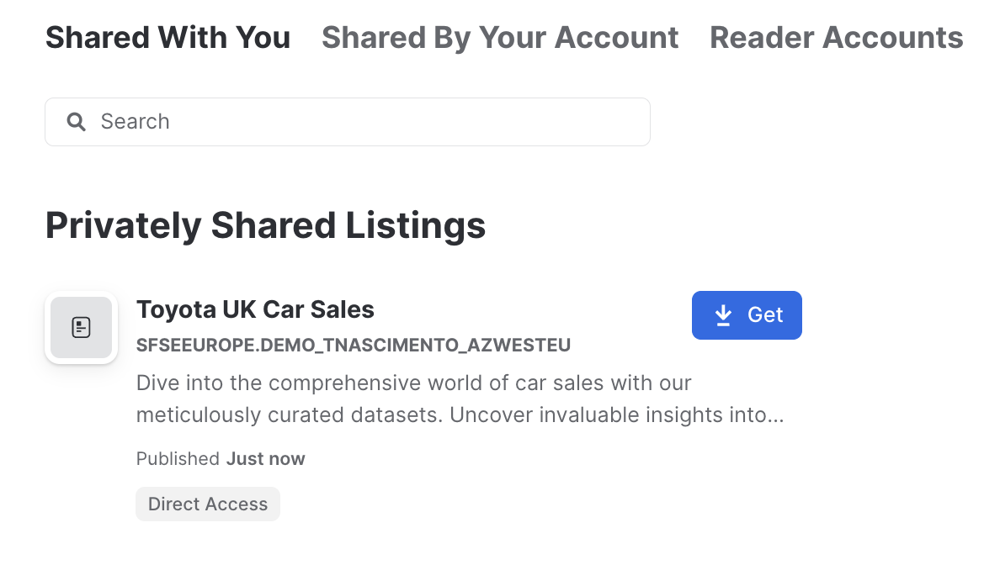

# Use Data Sharing with Snowflake 

This lab will help to load data into a Snowflake account, run some analysis and securely share data with another Snowflake account using Private Listings. 

You will be given an account, user and password to execute this lab. 

## 1. Accessing your Snowflake account

Your Snowflake Account URL will be provided via email. 

A user and password will be assigned to each individual running this lab. 

Access the provided Snowflake URL, use the credentials provided and change the default password to a password of your choice.  If you forget your password, please ask the admin your password on your behalf.

You will be redirected to Snowsight, Snowflake's UI. 

## 2. Create your own warehouse and database

Let's start creating the first Snowflake objects needed to run this lab. 

Create a new worksheet. 

Start by setting the context for your user. In all instances throughout this lab, replace USERX by your user name. 

```sql
use role ACCOUNTADMIN;
```

[!IMPORTANT]  
In order to create unique objects in Snowflake, make sure to use your user name as part of the object name. For example, if your user name is USER1, create your database as USERX_WH.

Create a database.

```sql
create or replace database USERX_DB;
```

Create different schemas for the RAW and ANALYTICS layer.
```sql
create or replace schema RAW;
create or replace schema ANALYTICS;
```

Create a warehouse.
```sql
create or replace warehouse USERX_WH with 
	warehouse_size = 'XSMALL' 
  warehouse_type = 'STANDARD'
  auto_resume = true 
  auto_suspend = 600   
  max_cluster_count = 2
  min_cluster_count = 1;
```

## 3. Ingest data

The dataset to be used in this lab will be available for you in an external stage in Azure blob storage.

A Storage Integration has been created prior to this lab for you to use. You can check this integration by using a DESCRIBE command.

```sql
DESCRIBE STORAGE INTEGRATION AZUREBLOB; 
```

Let's create a Snowflake stage that points to this stage in Azure. 

Remember to change USERX by your user name.

Start by setting the right context.

```sql
use database USERX_DB;
use warehouse USERX_WH;
use schema RAW;
```

Create a file format that will match the raw files.
```sql
CREATE OR REPLACE FILE FORMAT USERX_CSV
  TYPE = csv
  FIELD_DELIMITER = ','
  FIELD_OPTIONALLY_ENCLOSED_BY = '"'
  PARSE_HEADER = true 
  TRIM_SPACE = true
  SKIP_BLANK_LINES = TRUE
  ERROR_ON_COLUMN_COUNT_MISMATCH = FALSE;
```

We are using PARSE_HEADER to infer the schema from the file header. 

Now, create a stage using your newly created file format.
```sql
CREATE OR REPLACE STAGE CAR_SALES_STAGE
  STORAGE_INTEGRATION = AZUREBLOB
  URL = 'azure://trsnfiles.blob.core.windows.net/carsalesdata/'
  FILE_FORMAT = USERX_CSV;
````

Check your stage.
```sql
list @CAR_SALES_STAGE;
```

Use the INFER_SCHEMA table function to check the schema in the files.

```sql
SELECT *
  FROM TABLE(
    INFER_SCHEMA(
      LOCATION=>'@CAR_SALES_STAGE/1',
      FILE_FORMAT=>'USERX_CSV',
      IGNORE_CASE => true
      )
    );
```

Create a table with the inferred schema.
```sql
CREATE OR REPLACE TABLE CAR_SALES_TB
    USING TEMPLATE (
        SELECT ARRAY_AGG(OBJECT_CONSTRUCT(*))
          WITHIN GROUP (ORDER BY order_id)
        FROM TABLE(
            INFER_SCHEMA(        
              LOCATION=>'@CAR_SALES_STAGE/1',
              FILE_FORMAT=>'USERX_CSV',
              IGNORE_CASE => true
            )
        )
    );
```

Check the table.
```sql
DESC TABLE CAR_SALES_TB;
```

The schema does not match the table that we want to create for this dataset. Then instead of letting Snowflake infer the schema on load, we will define the schema.

Change the table to add a column called MANUFACTURER.
```sql
ALTER TABLE CAR_SALES_TB ADD COLUMN MANUFACTURER STRING;
DESCRIBE TABLE CAR_SALES_TB;
```

Recreate the file format with the valid options.
```sql
CREATE OR REPLACE FILE FORMAT USER0_CSV
  TYPE = csv
  FIELD_DELIMITER = ','
  FIELD_OPTIONALLY_ENCLOSED_BY = '"'
  SKIP_HEADER = 1
  TRIM_SPACE = true
  SKIP_BLANK_LINES = TRUE
  ERROR_ON_COLUMN_COUNT_MISMATCH = FALSE;
```
Now, ingest the data using the COPY command. Note that we are loading most columns from the raw csv as-is into the Snowflake table. We will add manufacturer information capturing the name of the file in the stage.

```sql
COPY INTO CAR_SALES_TB FROM (
  SELECT 
    $1 as MODEL,
    $2 as YEAR,
    $3 as PRICE,
    $4 as TRANSMISSION,
    $5 as MILEAGE,
    $6 as FUELTYPE,
    $7 as TAX,
    $8 as MPG, 
    $9 as ENGINESIZE ,
    REGEXP_SUBSTR(METADATA$FILENAME, '/([^/]+)\.csv', 1, 1, 'e', 1) as MANUFACTURER 
  FROM @CAR_SALES_STAGE/1 (FILE_FORMAT => USERX_CSV)
) FORCE = TRUE;
```

Load more files from a different folder in the stage, which contains files in a slightly different format.

```sql
COPY INTO CAR_SALES_TB FROM (
  SELECT 
    $1 as MODEL,
    $2 as YEAR,
    $3 as PRICE,
    $4 as TRANSMISSION,
    $5 as MILEAGE,
    $6 as FUELTYPE,
    NULL as TAX,
    NULL as MPG, 
    $7 as ENGINESIZE,
    REGEXP_SUBSTR(METADATA$FILENAME, '/([^/]+)\.csv', 1, 1, 'e', 1) as MANUFACTURER
  FROM @CAR_SALES_STAGE/2 (FILE_FORMAT => USERX_CSV)
) FORCE = TRUE;
```

Check data loaded into your table.
```sql
SELECT * FROM CAR_SALES_TB;
```

## 4. Transform your data and prepare it for sharing
As good practice, make all transformations and analysis in a different schema/layer.

Change to the schema ANALYTICS.
```sql
use schema ANALYTICS;
```

Update the MANUFACTURER data to upper case.

```sql
create or replace table CAR_SALES_TRANSFORMED
as select 
    MODEL, YEAR, PRICE, TRANSMISSION, MILEAGE, FUELTYPE, TAX, MPG, ENGINESIZE, UPPER(MANUFACTURER) AS MANUFACTURER
from RAW.CAR_SALES_TB;
```

You can transform data in Snowflake with SQL and with Snowpark which supports Python, Java and Scala.

Check your transformed data. Confirm you are using the schema ANALYTICS.
```sql
select * from CAR_SALES_TRANSFORMED;
```

Create a secure view to be shared with other Snowflake accounts.
```sql
CREATE OR REPLACE SECURE VIEW CAR_SALES_BMW_VIEW AS 
  SELECT [MODEL, ENGINESIZE] MODEL, YEAR, AVG(PRICE) AS AVERAGE_PRICE
  FROM CAR_SALES_TRANSFORMED
  WHERE MANUFACTURER = 'BMW' 
  GROUP BY ALL;
```

Check your view.
```sql
select * from CAR_SALES_BMW_VIEW;
```

## 5. Share your data using Private Listing

Go to Snowflake main page, and select **Data -> Private Sharing**. 


In this page, select the button Share and the option **Publish to Specified Customers**. You will be presented with the screen below. 



Give a name to your listing and select **Only Specified Consumers** and then **Next**.

In the following page, as below, select the dataset you would like to share. 

> [!NOTE]
> Make sure you select the view created 4 of this lab in the step 



Give your listing a description and select **Save Draft**.

You will be redirected to your listing page, which is still in Draft.

In the tab **Consumer Accounts**, select **Add**.



Add a consumer account. Here is where you will provide an account identifier to share the data with.

Use the as account identifier **SFSEEUROPE.DEMO_TNASCIMENTO_AZWESTEU**.

Select refresh rate for **1 minute** and then select your warehouse created on Step 2.



Select **Save** and in the listing page select **Publish**. And that's it! You have just shared data with another Snowflake account. Your instructor will show how the data is displayed in the consumer account. 


## 6. Consume data available via Private Listing

Go to Snowflake main page, and select **Data -> Private Sharing** and the tab **Shared With You**.

Check for a dataset called **Toyota UK Car Sales** which is available for you. 



Select **Get** to get the data available in your account. 


